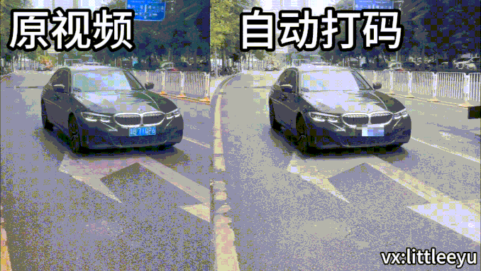

# AutoMosaic：对图像中的车牌和行人进行马赛克处理
# 概述
AutoMosaic 是一个用于解决隐私问题的 Python 脚本，通过自动对图像中的敏感信息（如车牌和行人）进行马赛克处理，保护个体隐私。该脚本利用AI模型执行目标检测，然后应用马赛克滤镜来遮蔽检测到的区域，确保个体信息的隐私安全。  


# 主要特性
*车牌匿名化*：检测并匿名化图像中存在的车牌。 

*行人隐私*：识别并对行人进行马赛克处理，以保护他们的隐私。

# 安装
* 使用 pip 安装所需的依赖项：
```
pip install ultralytics
```
* 下载模型  
[点击下载模型 model.pt](https://drive.google.com/file/d/1yFOyaloi4HZ1Z287kzkpqTQ5bMZ52cgs/view?usp=sharing)
* 克隆仓库：
```
git clone https://github.com/JiayuXu0/AutoMosaic.git
cd AutoMosaic
```
* 运行脚本并提供目标图像的路径：

```
python detect.py
```
脚本将生成一个输出图像，其中包含经过马赛克处理的车牌和行人。

# 贡献与问题 

微信联系：littleeyu
---

# AutoMosaic: Anonymize License Plates and Pedestrians in Images
# Overview
AutoMosaic is a Python script designed to address privacy concerns by automatically anonymizing sensitive information such as license plates and pedestrians in images. The script utilizes the model from Ultralytics to perform object detection, and then applies a mosaic filter to mask the detected regions, ensuring the privacy of individuals and their identifiable information.

# Key Features
*License Plate Anonymization*: Detects and anonymizes license plates present in images.
*Pedestrian Privacy*: Identifies and masks pedestrians to protect their privacy.

# Installation
Install the required dependencies using pip:
```
pip install ultralytics
```
# Download Model  
[Download model.pt](https://drive.google.com/file/d/1yFOyaloi4HZ1Z287kzkpqTQ5bMZ52cgs/view?usp=sharing)
# Clone the repository:

```
git clone https://github.com/JiayuXu0/AutoMosaic.git
cd AutoMosaic
```

Run the script with the path to the target image:

```
python detect.py
```
The script will generate an output image with anonymized license plates and pedestrians.

# Contributions and Issues
wechat: littleeyu